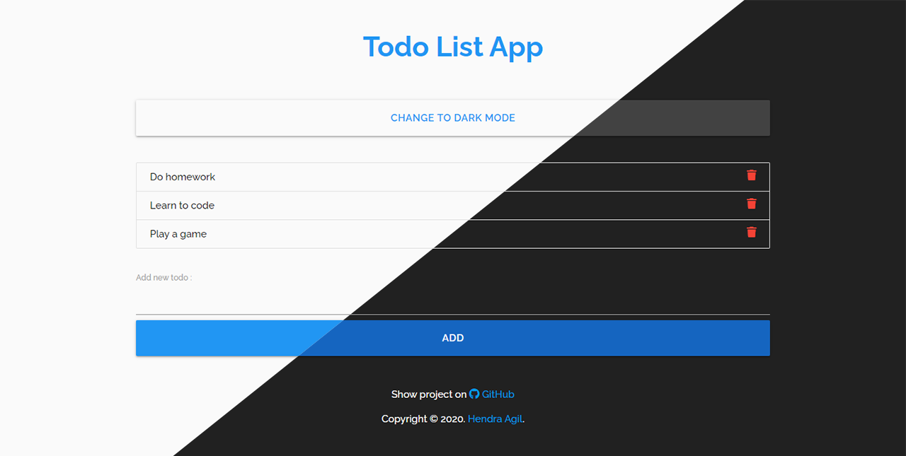

# Simple Todo App

## To run this app in your machine

1. Clone this repository  
   `git clone git@github.com:hendraaagil/simple-todo-app.git`
2. Install all dependencies  
   `npm install`
3. Run app  
   `npm start`

Happy Coding!
